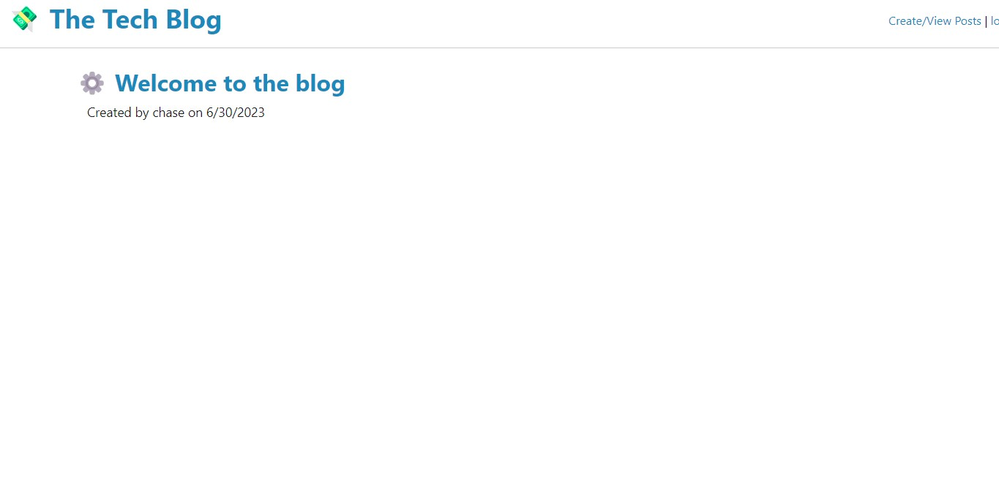
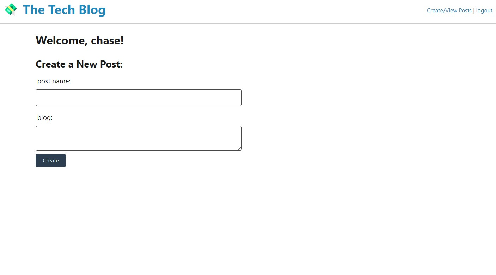
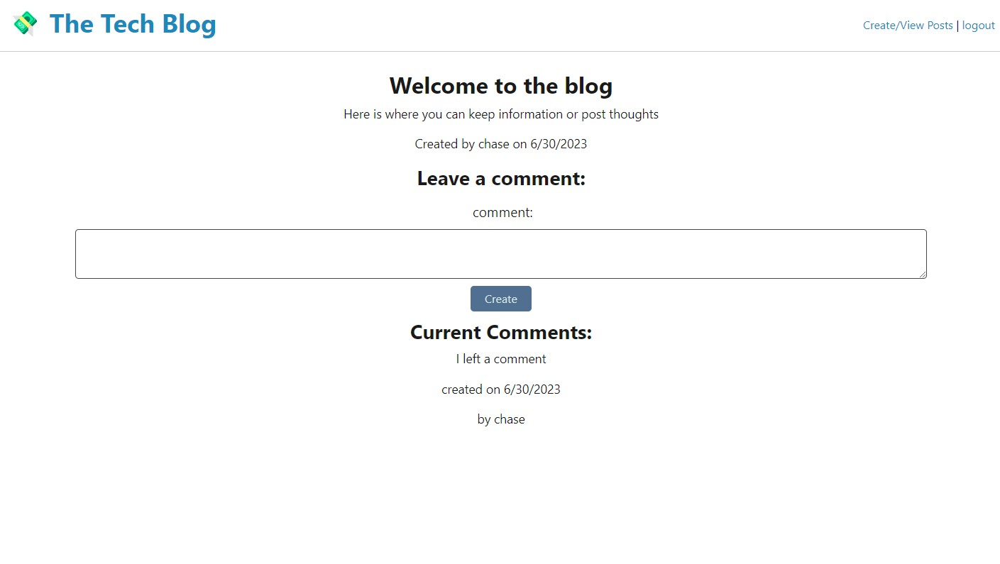

# The Tech Blog
 
 ## Badges

## Description
This blog allows users to view posts while not logged in. If you sign up and log in, you can create, view, and comment on other blog posts. 

## Table of Contents
- [Description](#description)
- [Installation](#installation)
- [Usage](#usage)
- [Credits](#credits)
- [License](#license)
- [Badges](#badges)
- [Features](#features)
- [Tests](#tests)
- [Questions](#questions)

## Installation
Access through live link.

## Usage
These are a few ways you can use the site:

## Credits
This project had some heavy lifting from the AskBCS team, classwork, and my teacher Luis.

## License

This project is covered under the MIT License

## Features

Log in and log out, sign up for an account, write a post, delete the post, comment on other people's posts.

## How to Contribute
N/A

## Tests
Create an account and write up posts.

## Questions
https://github.com/chasechambers

I can be reached via e-mail at:
chambers.chase@gmail.com